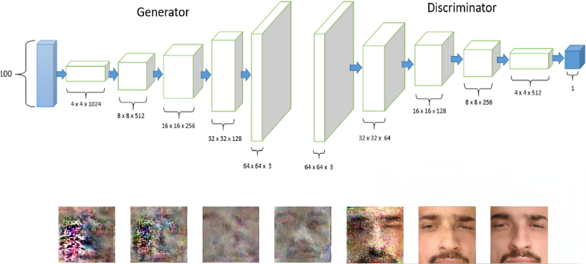

This project involves experiments with GANs (Generative Adversarial Networks) for generating high-quality face images based on the CelebA dataset. 

## Project Overview

- **Dataset**: CelebA dataset containing diverse face images.
- **Model**: Generative Adversarial Network (GAN) with custom architecture and enhancements.
- **Objective**: To generate realistic face images through adversarial training.

## Features

- Custom GAN architecture for high-quality face synthesis.
- Support for experimental configurations to optimize generation.
- Integration with CelebA dataset preprocessing and augmentation.

## Architecture

  
*Figure 1: GAN Architecture Overview*

## Results

  
*Figure 2: Sample Generated Face Images*

## How to Run

1. Clone this repository:
   ```bash
   git clone https://github.com/ahmad786writes/CelebA-Face-Generation-GAN-Experiments
   ```

2. Install dependencies:
   ```bash
   pip install -r requirements.txt
   ```

3. Run the experiments notebook:
   ```bash
   jupyter notebook "CelebA Face Generation GAN Experiments.ipynb"
   ```

## License

This project is licensed under the MIT License - see the [LICENSE](LICENSE) file for details.

## Contributing

Contributions are welcome! If you'd like to contribute to this project, please follow these steps:

1. Fork the repository.
2. Create a new branch for your feature or bug fix:
   ```bash
   git checkout -b feature-name
   ```
3. Commit your changes:
   ```bash
   git commit -m "Describe your feature"
   ```
4. Push your branch:
   ```bash
   git push origin feature-name
   ```
5. Submit a pull request explaining your changes.

## Acknowledgments

- **Dataset**: [CelebA dataset](http://mmlab.ie.cuhk.edu.hk/projects/CelebA.html)
- **Framework**: TensorFlow
- **Inspiration**:
  - **GANs**: [Generative Adversarial Networks](https://arxiv.org/abs/1406.2661) by Ian Goodfellow et al.
  - **DCGAN**: [Unsupervised Representation Learning with Deep Convolutional Generative Adversarial Networks](https://arxiv.org/abs/1511.06434) by Radford et al.
  - **DRGAN**: [Representation Learning by Rotating Your Faces](https://arxiv.org/abs/1705.11136) by Tran et al.
